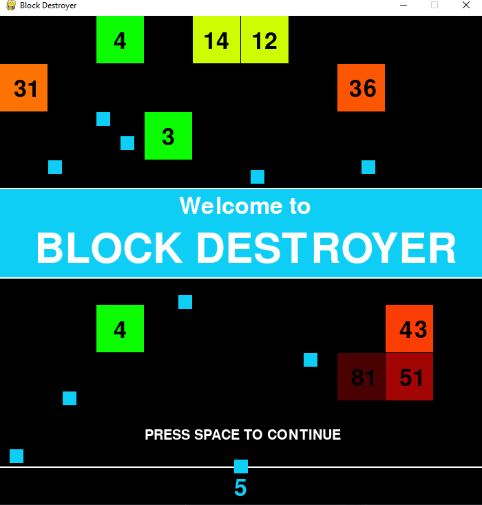
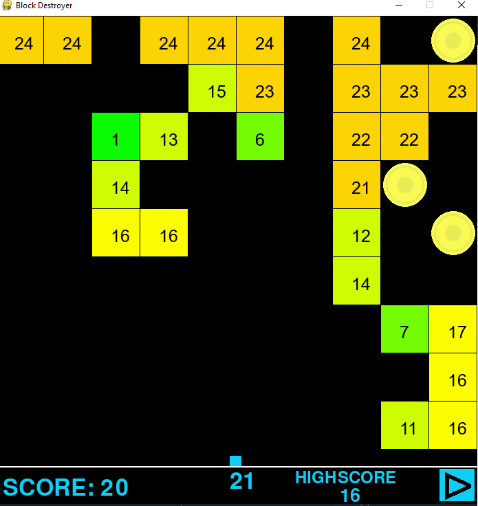

# Block Destroyer
## Author: Łukasz Serafin

### Short description
In Block Destroyer your mission is to survive as long as possible. 
Destroy oncoming blocks and collect coins to increase the number of balls available
and break the current highscore on one of three difficulty levels available!

### Technologies
- **Python** - Programming language on which the project is based (version 3.8.8 or later recommended)
- **Pygame** - Module used for creating simple games in python

### How to run this app?
1. Clone the template project, replacing my-project with the name of the project you are creating: 
`git clone  https://github.com/Sifloleux/Block-Destroyer.git Block-Destroyer`
`cd Block-Destroyer `
2. Install the project's development and runtime requirements:
`pip install -r requirements.txt`

3. Run the game:
`python Block-Destroyer.py`
\
